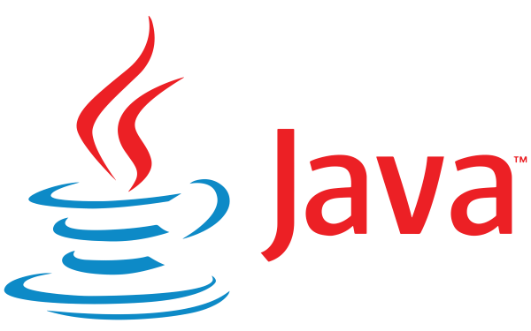

### Java Programming

### Deskripsi Singkat tentang Java Fundamental

**Java Fundamental** merujuk pada konsep dan keterampilan dasar yang diperlukan untuk memulai pemrograman menggunakan bahasa Java. Java adalah bahasa pemrograman yang berorientasi objek, platform-independen, dan dirancang untuk memiliki sedikit ketergantungan implementasi. Ini menjadikannya sangat populer dalam pengembangan aplikasi bisnis, aplikasi web, dan aplikasi seluler.

#### Konsep Utama dalam Java Fundamental

1. **Sintaks Dasar dan Struktur Program**:
    - **Variabel dan Tipe Data**: Pengenalan tipe data dasar seperti `int`, `double`, `char`, `boolean`, serta cara mendeklarasikan dan menggunakan variabel.
    - **Operator**: Penggunaan operator aritmatika, logika, dan perbandingan.
    - **Kontrol Aliran**: Pernyataan kondisi (`if`, `else if`, `else`), perulangan (`for`, `while`, `do-while`), dan pernyataan `switch`.

2. **Pemrograman Berorientasi Objek (OOP)**:
    - **Kelas dan Objek**: Definisi kelas, pembuatan objek, dan penggunaan atribut serta metode.
    - **Enkapsulasi**: Menggunakan modifier akses (private, public, protected) untuk mengontrol akses ke data.
    - **Inheritance (Pewarisan)**: Membuat hierarki kelas untuk memodelkan hubungan "is-a".
    - **Polimorfisme**: Kemampuan metode untuk bertindak berbeda berdasarkan objek yang memanggilnya, biasanya menggunakan overriding dan overloading.
    - **Abstraksi**: Menggunakan kelas abstrak dan antarmuka untuk mendefinisikan kontrak bagi kelas yang mengimplementasikannya.

3. **Struktur Data dan Koleksi**:
    - **Array**: Penggunaan array untuk menyimpan kumpulan data yang berjenis sama.
    - **Koleksi Java**: Menggunakan kelas-kelas dari Java Collections Framework seperti `ArrayList`, `HashMap`, `HashSet`, dan `LinkedList`.

4. **Exception Handling**:
    - **Try-Catch-Finally**: Penanganan kesalahan menggunakan blok try-catch-finally untuk mencegah crash program.
    - **Custom Exception**: Membuat dan menggunakan pengecualian khusus untuk mengelola kondisi kesalahan spesifik.

5. **Input/Output (I/O)**:
    - **Baca/Tulis File**: Menggunakan kelas di paket `java.io` dan `java.nio` untuk membaca dari dan menulis ke file.
    - **Serialization**: Mengubah objek menjadi byte stream dan sebaliknya untuk penyimpanan atau transmisi.

6. **Penggunaan Library dan API Java**:
    - Pemahaman dasar tentang library dan API penting yang disediakan oleh Java, seperti `java.lang`, `java.util`, `java.io`, dan `java.net`.

#### Pentingnya Java Fundamental

Menguasai Java Fundamental adalah langkah awal yang sangat penting bagi siapa saja yang ingin menjadi pengembang perangkat lunak. Konsep-konsep dasar ini tidak hanya membangun fondasi yang kuat untuk pengembangan aplikasi lebih lanjut, tetapi juga membantu dalam memahami bahasa pemrograman lain dan konsep komputer secara umum. Java digunakan di berbagai bidang mulai dari pengembangan aplikasi web, aplikasi mobile dengan Android, hingga aplikasi enterprise, menjadikannya keterampilan yang sangat berharga di industri teknologi.